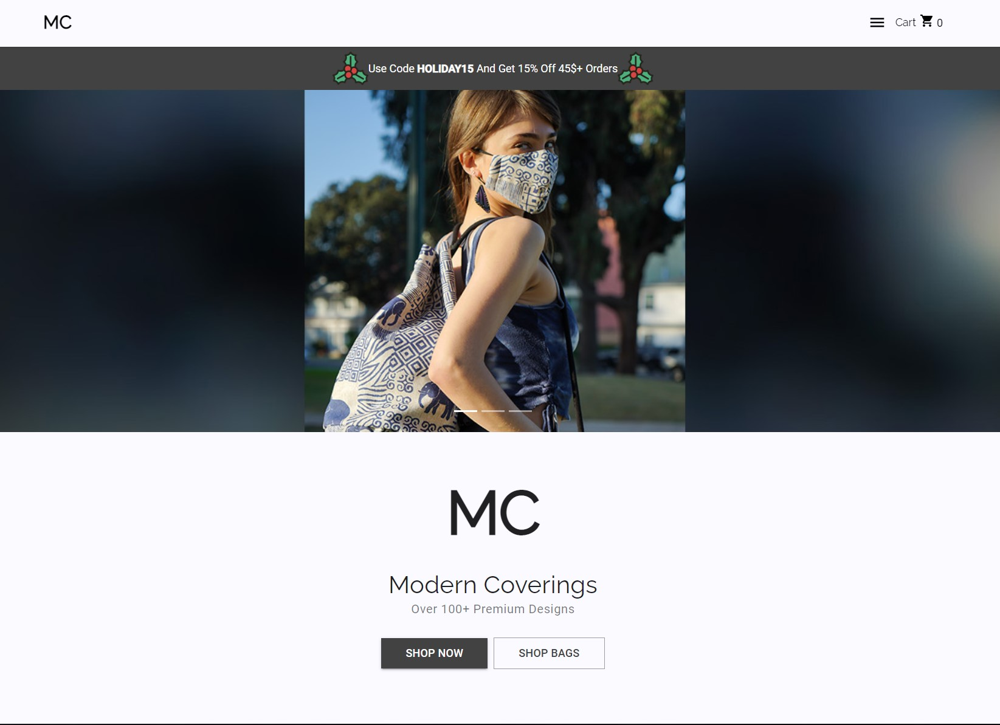

# Modern Coverings

Modern Coverings is an eCommerce site that offers over 300 different product designs in handmade bags and face coverings. For administration, there is a dashboard with various capabilities such as wholesale tracking, sales tracking, inventory management, and more. To date, there have been over 35,000 products sold.

[Please visit the website at ModernCoverings.com](https://ModernCoverings.com)

## Front End

-   Modern Covering's front end is built upon React. Hooks are exclusively used to render all content. There is gratuitous use of common hooks such as useState and useEffect to enable interactions.

-   State is managed by Redux assisted by RTK (Redux Tool Kit). State that is managed by Redux includes the customer order, the order amount, previous Y-Coordinates, whether the discount button was clicked, and more.

-   Material UI - The style framework of choice is Material UI. It has a strong library of various pre-built components that are very customizable. Appility relies upon various UI components such as the Navbar, LinearProgress, Cards, Grids, etc. For customization, there is much use of Material UI's makeStyles and useMediaQuery.

## Back End

Modern Coverings leverages serverless architecture for its backend. The benefits of serverless architecture is cost (you only pay for what you use), scalability (services scale automatically according to traffic), and ease (no need to manage or maintain a server).

-   API Gateway - All API services are hosted on API Gateway, which acts as a "front door" for all API requests. API Gateway handles all tasks involved in accepting and processing up to hundreds of thousands of concurrent API calls, CORS support, authorization, etc. I use API Gateway to accept/validate API calls and forward them to Lambda for processing.

-   Lambda - While API Gateway acts as the "front door" to the serverless backend, Lambda does all the heavy lifting when it comes to processing requests, interacting with the database, and returning the appropriate response. An example of my Lambda usage is handling get requests: When API Gateway receives a GET request, it forwards all the relevant information including the user ID to the appropriate Lambda function.

-   DynamoDB is used to store sales data, requested products, wholesale orders, and more. DynamoDB is a NoSQL database that is also serverless. It scales automatically and this lends itself to ease of use and cost savings.

## Deployment

-   S3 - Upon CodeBuild completion, CodeDeploy takes the resulting build directory and stores it in an S3 Bucket that is configured to host websites.

-   CloudFront - CloudFront is AWS' Content Delivery Network (CDN) service. CloudFront is used to distribute the contents of my website contained in the S3 bucket for best performance throughout the network.

-   Amazon Certificate Manager - SSL certification is provide freely by ACM; this ensures all information in-flight is sent securely using encryption.
